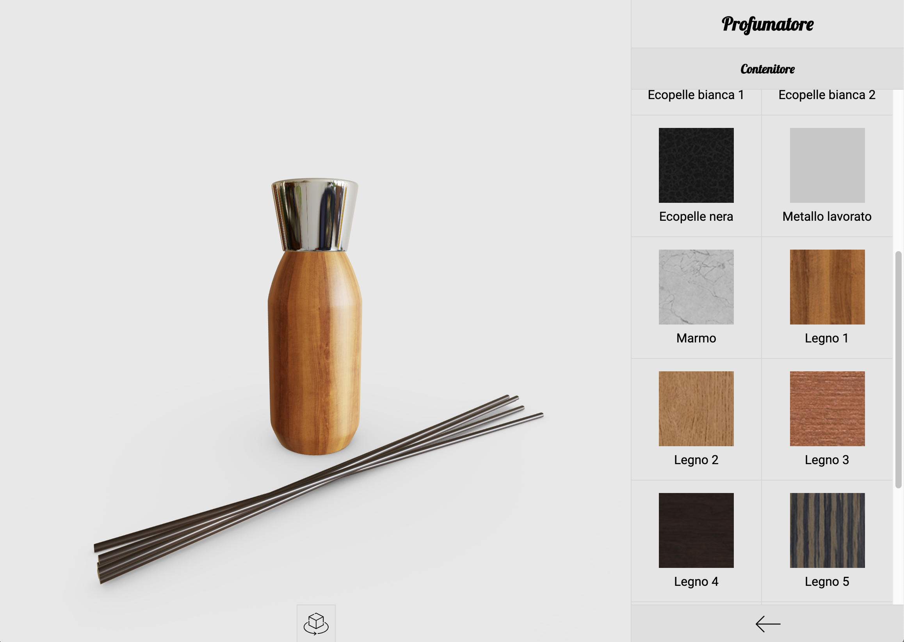
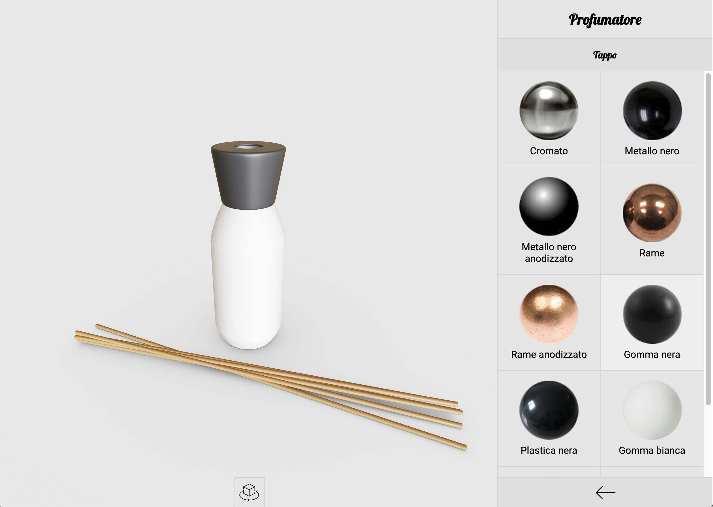
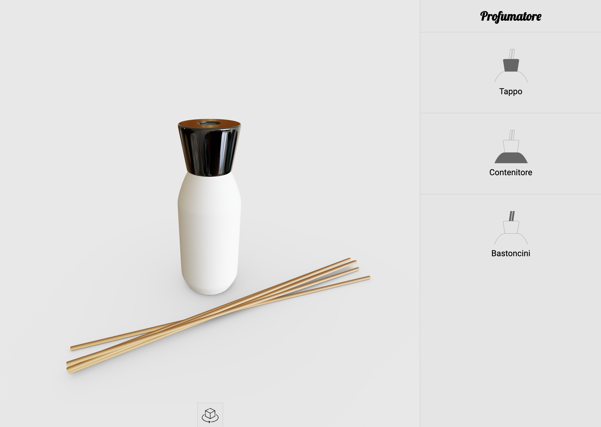
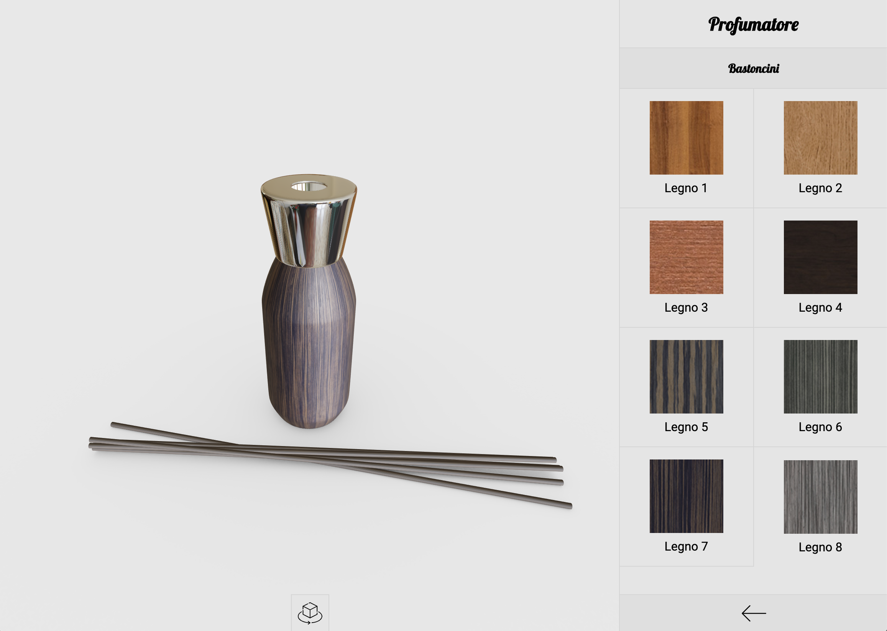

# Configuratore Profumatore

## Descrizione
Il progetto ha l'intenzione di sviluppare un configurare prodotto, più precisamente la configurazione di un profumatore per l'ambiente.

### Struttura del progetto
- <code>index.html</code>: contiene la pagina vera a propria del configuratore ma di fatto non fa nulla se non caricare gli script e ospitare il contentuto della pagina
- <code>css/style.css</code>: in questo file sono contenuti i vari stili utilizzati dai vari componenti all'interno della pagina
- <code>img/*</code>: in questa cartella sono contenute alcuna immagini utilizzate dall'interfaccia, più precisamente le preview dei materiali ed alcune icone
- <code>js/configurator.js</code>: questo file contiene tutta la logia dell'interfaccia grafica del configuratore, quindi la creazione dei vari menù e l'interazione con gli stessi per andare ad applicare i materiali alle varie componenti del profumatore
- <code>js/materials.js</code>: questo file contiene la "libreria" dei materiali utilizzati del configuratore, compresa la logica per il loro caricamento ed inizializzazione
- <code>js/preview.js</code>: in questo file è contenuto tutto ciò che riguarda la creazione dell'anteprima 3D, come il caricamento del modello, l'inizializzaione della scena, l'impostazione della telecamera, ecc
- <code>lib/*</code>: in questa cartella è contenuto ThreeJS ed alcune altre librerie, sempre legate a ThreeJS, utilizzate dal configuratore
- <code>models/*</code>: in questa cartella sono contenuti i file **.blend** del modello del profumatore ed il relativo file **.glb** della sua espostazione in formato glTF
- <code>textures/floor_ambient_occlusion.png</code>: texture di occlusione ambientale applicata al pavimento generata tramite Blender
- <code>textures/reading_room_1k.hdr</code>: environment map utilizzata per le riflessioni e per illuminare la scena, scaricata da HDRI Heaven
- <code>textures/materials/*</code>: in questa cartella sono contenute tutte le texture utilizzate nei vari materiali gestiti dal configuratore, scaricate dal sito Poliigon (le texture utilizzate per il parametro roughness sono state invertte con Photoshop in quanto Poliigon mette a disposizione, tranne che in alcuni casi, solo la texture gloss)

## Risultato finale
Il risultato finale si è rivelato essere buono, anche meglio di quanto prospettato inizialmente.
Il framerate è deciamente buono, soprattuto dovuto al fatto che sia il modello da renderizzare che i materiali utilizzati sono molto semplici.

## Processo di sviluppo
Lo sviluppo è partito dalla modellazione del profumatore utilizzando Blender, continuando poi lo sviluppo del codice vero e proprio per la pagina del configuratore attraverso i soliti strumenti.
Per la creazione dei materiali ho cercato riferimenti online su valori da utilizzare per modellare alcuni materiali come il cromo, il rame, ecc. mentre ho utilizzato delle texture già pronte per tutti i materiali che le richiedevano, quali i vari legni, le pelli ed il metallo lavorato.

Strumenti utilizzati:
- <code>Visual Studio Code</code>: editor di testo per scrivere il codice HTML e JavaScript necessario
- <code>Blender</code>: modellatore 3D per la realizzazione del modello del profumatore e la generazione della texture di occlusione ambientale del pavimento
- <code>Photoshop</code>: editor di immagini utilizzato per modificare alcune delle preview del materiali ed invertire le texture gloss per rendere delle texture roughness
- <code>Illustrator</code>: editor di immagini vettoriali utilizzato per creare alcune delle icone del configuratore
- <code>Chrome</code>: browser utilizzato per testare e debuggare il configuratore
- <code>Git</code>: strumento di versioning

Siti web utilizzati:
- <code>[Poliigon](https://www.poliigon.com)</code>: sito da dove ho scaricato le texture per alcuni materiali
- <code>[HDRI Heaver](https://hdrihaven.com)</code>: sito da dove ho scaricato l'environment map utilzzata